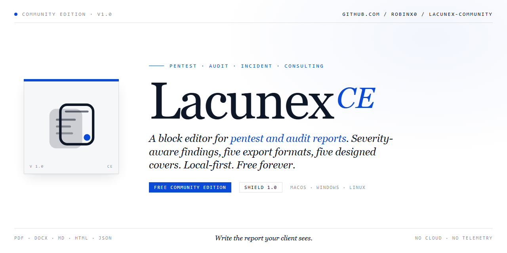

<p align="center">
  
</p>

<p align="center">
  
</p>

<h1 align="center">Lacunex Community</h1>

<p align="center">
  A local-first desktop app for writing pentest, audit, incident, and
  consulting reports.
</p>

<p align="center">
  <a href="https://github.com/robinx0/lacunex-community/releases/latest"></a>
  <a href="https://github.com/robinx0/lacunex-community/blob/main/LICENSE"></a>
  
</p>

Reports stay on your laptop. No cloud sync, no account, no telemetry.
Source-available under PolyForm Shield 1.0.0.

## Download

Installers for macOS (Universal, Intel and Apple Silicon), Windows (x64),
and Linux (`.deb`, `.rpm`, `.AppImage`, all x64) live on the
[Releases](https://github.com/robinx0/lacunex-community/releases) page.
After launch the app checks for updates every six hours; you can turn
that off in Settings.

The 1.0 installers are not code-signed yet, so the OS will warn you the
first time you open them:

- **macOS**: right-click the app, choose Open, confirm the warning. The
  next launch is normal.
- **Windows**: SmartScreen says "Windows protected your PC". Click
  More info, then Run anyway.
- **Linux**:
  - `.deb` (Ubuntu, Debian, Kali, Parrot, Mint, Pop!_OS):
    `sudo apt install ./lacunex-community_1.0.0_amd64.deb`
  - `.rpm` (Fedora, RHEL, openSUSE, Rocky, AlmaLinux):
    `sudo dnf install ./lacunex-community-1.0.0.x86_64.rpm`
  - `.AppImage` (any distro, no install required):
    `chmod +x Lacunex-Community-*.AppImage && ./Lacunex-Community-*.AppImage`

## What it does

A block editor with 21 block types tuned for security and audit work:
findings, screenshots, code with syntax highlighting, callouts, PoC
steps, HTTP request/response panels, severity badges, asset chips, CVE
references, tables, and so on.

Findings are first-class objects. Each one carries an ID, severity, CVSS,
CWE, status, body, PoC, and remediation. They're full-text searchable and
you can save any finding as a reusable template.

Four export formats: PDF (with paginated body, a styled cover, and a
per-page footer), Word `.docx`, HTML, and Markdown.

If you have a local [Ollama](https://ollama.com) running, the editor's AI
commands light up (suggest remediation, improve clarity, summarize).
Everything runs on your machine. The app works fine without Ollama
installed — the AI buttons just don't appear.

Auto table of contents from your H1/H2/H3 headings. Paste or drag-drop
images from the clipboard or your file manager.

## Report templates

When you click **+ New report** you get these scaffolds:

- Engineering Postmortem
- Security Incident
- Audit Gap Assessment (SOC 2, ISO 27001, HIPAA, PCI, NIST)
- Consulting Assessment
- Project Status Report
- Research Report
- Executive Brief
- Pentest Engagement
- Exam Report — OSCP
- Exam Report — Generic (CRTP, CRTO, OSEP, OSWP, PNPT, eJPT, eCPPT, etc.)
- Blank report

Two finished sample reports live in [`examples/`](./examples/) if you
want to see the output before installing.

## Local AI (optional)

The AI features hit a local Ollama instance. No cloud LLM, no API key,
no rate limit.

```bash
ollama pull llama3.2:3b
ollama serve
```

Restart Lacunex and the AI commands appear in the editor. If you skip
this step the rest of the app behaves exactly the same.

## Cover designs

| Cover | Theme | Best for |
|---|---|---|
| **Tradecraft** (Dark, Light) | Tactical mono with grid | Pentest reports |
| **Boardroom** (Light, Dark) | Institutional, navy or brass accent | Audit, consulting |
| **Vellum** (Light, Dark) | Swiss minimalism, off-white | Research, executive briefs |
| **OSCP Crimson** | OffSec-style crimson with OSID block | OSCP exam reports |
| **Spine Ink** | Cream paper with colored book-spine | Generic exam / certification reports |

Each cover has palette presets, optional logo upload (PNG, JPG, GIF,
WebP up to 256 KB), and a text-scale slider.

## Privacy

Lacunex is local-first by architecture, not by setting:

- Reports live in a SQLite file plus an `attachments/` folder under your
  OS app-data directory.
- No account creation, no sign-up.
- No usage analytics, no crash reporting, no third-party SDKs.
- The only outbound network calls are the 6-hourly update check against
  GitHub Releases (opt-in) and, if you installed Ollama, your local AI
  instance on `127.0.0.1:11434`.
- Every network call site is auditable in
  [`src/main/services/`](./src/main/services/).

## Build from source

Needs Node 20 or newer.

```bash
npm install
npm run dev        # development server with hot reload
npm run typecheck  # tsc, strict
npm run lint       # eslint
npm run test       # vitest
npm run package    # build installer for current platform
```

## Architecture

Two-process Electron app. The renderer (React, Tiptap, Tailwind, Zustand)
never touches the filesystem or the database. It talks to the main
process through a `contextBridge`-exposed `window.lacunex` surface; every
IPC channel is validated by Zod. Main owns SQLite (`better-sqlite3`), the
attachments directory, and the export pipeline: PDF via a hidden
`BrowserWindow` plus Chromium's `printToPDF` (with optional `paged.js`
for per-page footers), `docx` for Word, plain string emit for Markdown,
HTML, and JSON.

No backend. No network calls during normal use.

## Contributing

Bug reports and feature requests are welcome — see the
[issue templates](./.github/ISSUE_TEMPLATE). Please read
[CONTRIBUTING.md](./CONTRIBUTING.md) before opening a PR.

For security disclosures, please **don't** open a public issue. Use
GitHub's Private Vulnerability Reporting instead (linked in
[CONTRIBUTING.md](./CONTRIBUTING.md#reporting-security-issues)).

## License

PolyForm Shield License 1.0.0. Plain-English summary:
[LICENSING.md](./LICENSING.md). Legal text: [LICENSE](./LICENSE).
